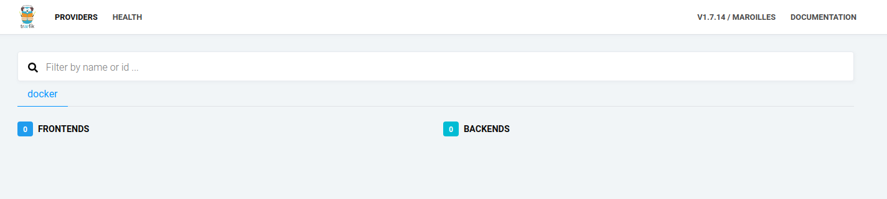

**Traefik** is a leading modern reverse proxy and load balancer that makes deploying microservices easy.

You can check their website at [https://containo.us/traefik/](https://containo.us/traefik/)

In this post I will show how to use a traefik instance with docker. The version used is **1.7.14**
The steps are explained in the github repository : [https://github.com/martinraynov/docker\_traefik](https://github.com/martinraynov/docker_traefik)

Once you started **Traefik** you can access the homepage at the link : [http://127.0.0.1:8081/dashboard/](http://127.0.0.1:8081/dashboard/)

