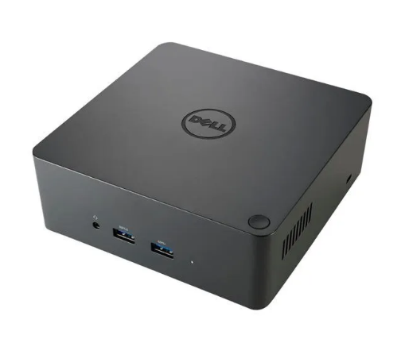

All the persons that have used a Dell docking stations under Linux have encountered the issue that it switches automatically the audio input/output to the ones on the dock. This is great if you have an audio input connected to your dock but if you don't you must always go to the preferences are switch back to the laptop defaults. 

This is not a problem if your laptop is always connected to the docking station but if you move a lot between your workspace and for example some meetings it starts to be very annoying to always have to reconfigure it.

Here I will explain how you can configure a default input/output that will persist even after you connect to your docking station.

This example is tested on specific Dell docking stations (but I think that the config is working on all Dell docks) : 

* DELL Dock WD15
* DELL Dock TB16
* DELL Dock WD19DC

### 1. Check the available inputs/outputs that are available

    pactl list short sinks
    pactl list short sources

In the results we have the ones that are configured for the Laptop. 

Example for sinks result : 

    #pactl list short sinks
    2    alsa_output.pci-0000_00_1f.3.analog-stereo    module-alsa-card.c    s16le 2ch 48000Hz    SUSPENDED

### 2. Update /etc/pulse/default.pa

In this file we must uncommented the last two lines and put the names of the sink(output)/source(input) that we have previously saved (from step 1): 

    ### Make some devices default
    set-default-sink <SINK NAME>
    set-default-source <SOURCE NAME>

You must also deactivate the module-switch-on-connect option :

    #load-module module-switch-on-connect

### 3. Clean the pulse config cache and reboot

You are almost done. You must just clean the config and reboot your computer :

    rm -rf ~/.config/pulse
    reboot

### 4. Enjoy ;)